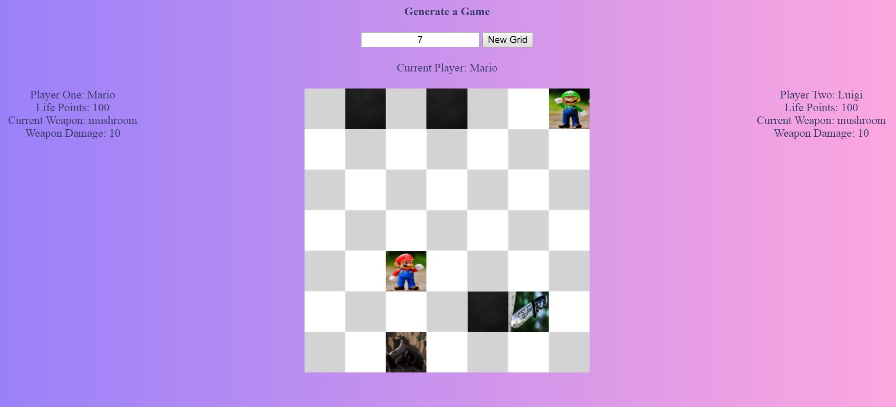

# Boardgame

# Getting Started

Start by randomly generating the game map.  

On the map, there will be a limited number of weapons (up to 4) which will be placed randomly and can be collected by players who pass through.  

The default weapon which team players must inflict 10 points of damage. Each weapon has a name and associated visual.  

The placement of the two players is also randomly placed on the map when the game initates and will have at least one square between them.  

# Moving Players

For each turn, a player can move from one to three boxes either horizontally or vertically before ending their turn. 
However if a box is blacked and they will not be able to pass through directly.  

Should a player pas over a box containing a weapon, they will leave their current weapon on site and replace it with the updated one.  

# Fight!

If players cross over adjacent squares either horizontally or vertically, then the battle will commence.  

During combat, the game works is as follows:  

Each player attacks in turn  

The damage depends on the player's weapon   

The player can choose to attack or defend against the next attack  

If the player chooses to defend themselves, they sustain 50% less damage than normal   

As soon as the life points of a player (initially 100) falls to 0, they lose. A message appears and the game is over.  

Best of luck to you future warriors!